<div align="center">


<br/>


**Letterboxd-style ratings, watchlist, lists & social layer for Jellyfin**

⭐ *If StarTrack is useful to you, please consider starring this repo!* ⭐

</div>

---

## 📑 Table of contents

- [Overview](#overview)
- [Features](#features) — external sync, i18n, ratings, views, Top 4, Letterboxd, search, social, admin
- [Screenshots](#-screenshots)
- [Requirements](#requirements)
- [Installation](#installation)
- [How to use](#how-to-use) — rating pill, My Ratings, Letterboxd
- [API Reference](#api-reference) — ratings, watchlist, diary, lists, Letterboxd, config
- [Data storage](#data-storage)
- [Building from source](#building-from-source)
- [Contributing](#contributing)
- [Support the project](#-support-the-project)
- [License](#license)

---

## Overview

StarTrack started as a simple star-rating plugin and has grown into a full **Letterboxd-style social layer for Jellyfin**: ratings, reviews, watchlists, liked films, a chronological diary with rewatches, Top 4 favourites, collaborative lists, recommendations, server-wide watchlist sharing, and full Letterboxd import/sync. Everything is stored as plain JSON on your own server — nothing leaves your network.

Designed to integrate cleanly with modern Jellyfin setups. Works on desktop and mobile.

---

## Features

### 🆕 New in 1.6

- **External rating sync (Trakt · Simkl · Yamtrack)** — connect an external service and StarTrack keeps your ratings in sync. Trakt uses device-code login, Simkl uses a PIN; admins drop the client ID/secret into the plugin config page, each user connects from the **⇄ External Sync** panel in *My Ratings*. Pick a direction per service — **Off / Export only / Import only / Two-way** — and a background task syncs every 10 minutes.
- **Newer-wins conflict resolution** — in two-way mode, the most recently changed rating wins, so a fresh local edit is never clobbered by a stale remote value (and vice-versa).
- **Watched history + likes push** *(Trakt)* — rated movies/episodes are also marked **watched** on Trakt (so History / Up Next populate), and your ♡ liked items are pushed to a "StarTrack Liked" list (plus Favorites if your Trakt account is VIP).
- **One-shot Backfill** — a button that seeds the whole service from your existing library in one pass. Simkl gets a dedicated date-accuracy repair so watched/rated dates are preserved instead of all stamped "today".
- **Yamtrack CSV export** — no released Yamtrack build exposes a public API yet, so StarTrack exports an **IMDb-format CSV** you import via Yamtrack → *Import → IMDb*. Marked experimental; the native provider is ready for when their REST API ships.
- **Daily auto-export** — a scheduled task writes your ratings out to a file every day for automatic backup.
- **Configurable poster rating badge position** — the gold ★ badge corner is now a setting (**top-right** default / top-left / bottom-right / bottom-left) so it no longer collides with Jellyfin's watched checkmark (issue #8).
- **Full 8-language i18n** for all of the new External Sync UI.

### 🆕 New in 1.5.2

- **Standalone page endpoint** — new `GET /Plugins/StarTrack/StandalonePage` returns a self-contained HTML page that hosts the StarTrack overlay with no surrounding Jellyfin web shell. Useful for embedding the full StarTrack UI inside a WebView (mobile app, smart-TV launcher, third-party clients, kiosk displays, etc.) without re-implementing every screen. Auth is passed in via `?token=...&userId=...` query params (so the embedded view never has to show a login screen), the page seeds Jellyfin's normal credential storage, loads the existing widget script, and auto-opens the My Ratings overlay. Same UI, same data, same REST API — just rendered without the rest of Jellyfin Web in the way. Anonymous endpoint so embedded viewers can fetch the shell before they plant credentials. No behavior change for normal Jellyfin Web users.

### 🆕 New in 1.5

- **Members tab** — every user on your server gets a profile card with avatar, total ratings, average star, and pinned Top 4 strip. Sort/search the grid.
- **Profile pages** — open a member to see their Letterboxd-style stats: rating histogram, genres, directors, actors, decades, longest film, hours watched, ratings-per-month timeline, calendar heatmap (last 365 days), on-this-day strip, most-rewatched strip, year-by-year cards.
- **Follow graph** — follow/unfollow buttons on every member card and profile. Followers / Following lists.
- **Activity feed** — chronological feed of recent ratings, reviews and diary entries from people you follow (or everyone), with filter chips.
- **Reviews tab** — per-user reviews list as its own profile tab.
- **Compare profile UI** — `⇄` button on member cards opens a side-by-side comparison: taste-similarity score (Pearson, mapped to 0–100%), per-side rating histograms, "biggest disagreements" rows with side-by-side stars and a delta chip, and a "films you both loved" strip.
- **Privacy toggles** — hide-from-members, hide-follower-count, hide-following, hide-stats, hide-recent-activity. Server-side enforced, applies on every browser.
- **Private lists** — opt-in `isPrivate` flag on lists; private lists are visible only to the owner.
- **Diary polish** — clearer `↻ Rewatch` pill on rewatched entries and a 3-column row layout that uses the empty space.
- **Performance** — profile and stats endpoints now serve cached data instantly while rebuilding fresh data in the background (stale-while-revalidate). Member-list pre-warms stats for every visible user, and a server-wide item/people cache means resolving a film's cast and crew is shared across all users instead of per-user.
- **Security pass** — assorted hardening across endpoints. No data migration required.

### 🆕 New in 1.4
- **8-language i18n** — en, fr, es, de, it, pt, zh, ja. Widget pill + panel + My Ratings overlay + admin page all translate.
- **User language picker** — 🌐 button in the rating panel lets each user pick their own language. Stored per-browser in localStorage.
- **User preferences modal** — ⚙ Preferences button in My Ratings opens a per-user settings dialog. Change language, hide the floating Rate pill, hide the post-playback rating popup.
- **Admin toggles** — Dashboard → Plugins → StarTrack now has a full settings form: default language, hide Recent / Letterboxd / Rate-pill floating buttons system-wide, replace native ratings on media detail pages, replace Media Bar plugin ratings, overlay ratings on library posters, post-playback rating popup.
- **Poster rating badges** — gold ★ badge in the top-right corner of every library card whose item has a StarTrack rating.
- **Media detail rating swap** — replaces Jellyfin's native community rating on detail pages with the StarTrack average + rater count.
- **Media Bar plugin rating swap** — if the Media Bar plugin is installed, its rating pills are replaced with StarTrack's average.
- **Post-playback rating popup** — when a movie or episode finishes, a small prompt appears asking the user to rate (only once per item, skipped if already rated).

### ⭐ Ratings & reviews
- **Half-star ratings** (0.5 – 5★) per item, per user
- **Written reviews** (optional, up to 1000 chars per rating)
- **Community average badge** displayed on every detail page above the metadata row
- **Per-user breakdown** — expandable list of every user's score and review on the detail panel
- **Star tier colours** — five visual tiers (5★ glowing gold → 1★ muted red) so the rating grid is scannable at a glance

### 🎞 Letterboxd-parity views
| | |
|---|---|
| **★ Films** | Full poster grid of everything you've rated, with a pinned Top 4 row |
| **☆ Watchlist** | Bookmark films to watch later — toggleable to show **everyone's combined watchlist** with per-user filtering |
| **♡ Liked** | One-tap heart toggle, separate from your star rating |
| **📖 Diary** | Chronological journal of every watch with **rewatch detection**, grouped by month, with visual star bars |
| **✍ Reviews feed** | Server-wide vertical feed of every rating that has a review, with poster, reviewer, star bar, date and review text |
| **✨ For you** | Personalised recommendations weighted by your top genres (movies + series). Reshuffle button rerolls 30 picks from a 60-candidate pool |
| **📃 Lists** | Create collaborative film lists that other users on your server can contribute to. Owner-only delete |

### ⭐ Top 4 favourites (per type)
- Pin up to 4 movies, 4 series and 4 episodes to your profile
- Sub-rows shown in the type tab they belong to (Movies tab → Top 4 Movies, etc)
- Empty slots show a clear "+ pin a film" placeholder so the feature is discoverable
- Hover any pinned slot to reveal an **× remove** button
- Hover any film card to reveal **⭐ pin to Top 4** and **+ add to a list** buttons

### 🔄 Letterboxd integration
- **Drop in your Letterboxd export ZIP** to import everything in one pass: `ratings.csv`, `diary.csv`, `watchlist.csv` and `likes/films.csv`
- **Browser-style User-Agent** so Letterboxd's anti-bot doesn't block sync
- **Sync now** button pulls your latest ratings (RSS), watchlist (RSS), and likes (HTML scrape) — one click, three data types
- **Hourly auto-sync** scheduled task for every user with a Letterboxd username configured
- **Import Top 4** button scrapes your Letterboxd profile's "favourite films" section
- **Export CSV** — download your StarTrack ratings in Letterboxd-compatible format for backup or migration
- **Diagnose** button — runs the library matcher and shows you exactly how many movies are indexed, how many duplicates exist, and how titles are normalised
- **Clean dead ratings** button — removes ratings that point to library items whose underlying file no longer exists (post-HDD-failure cleanup)

### 🔍 Search & filter
- **Live search input** in the topbar — filters the active view by title with a 150 ms debounce
- **Discrete star filter dropdown** — `5★ only`, `4.5★ only`, `4★ only` … down to `0.5★ only`
- **Sort dropdown** — date rated, film year, your rating, community rating, runtime, each ↑↓
- **Type tabs** — All / Movies / TV Shows / Episodes — drives both the grid and which Top 4 row is visible

### 👥 Collaborative & social
- **Everyone's watchlist** view — see what every user on your server wants to watch, sorted by most-wanted first, with a per-user filter dropdown to focus on a specific user
- **Collaborative lists** — owner can mark a list as collaborative and other users can add their own picks. Each item tracks who added it
- **Reviews feed** — see what everyone on the server thinks
- **Per-user attribution** on community averages so you know who rated what

### 🛠 Admin & infrastructure
- **Per-rating cleanup** — purge a single rating without nuking the whole profile
- **Multi-rating cleanup** — purge every rating that points to a missing library file
- **Mobile-responsive UI** — full `@media` query overhaul for phones and tablets
- **Client-side metadata cache** — switching between views is instant after the first load
- **MIT licensed** — fork it, modify it, self-host it, bundle it
- **Pure JSON storage** — no database. Just files in `<jellyfin-data>/data/InternalRating/`

---

## 📸 Screenshots

### Rating pill (detail pages)
A small floating pill appears at the bottom-right of every Movie / Series / Episode detail page. Click it to expand the full rating panel.

<p align="center">
  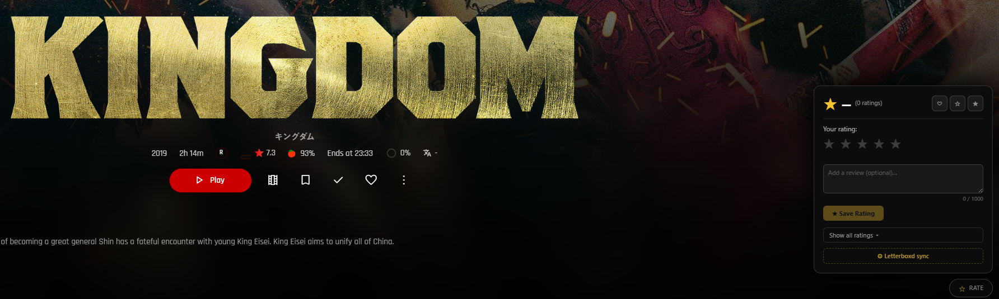
</p>

### Rating panel
Half-star precision, optional written review, community average with per-user breakdown, one-click heart / watchlist / Top 4 pin. "Show all ratings" expands every user's score.

<p align="center">
  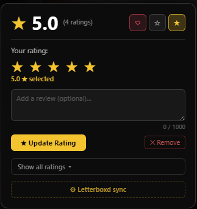
</p>

### Recent ratings + Letterboxd sync
The pill also shows your recent ratings at a glance. One tap opens the Letterboxd sync panel — enter your username, enable hourly auto-sync, or drop in your export ZIP.

<p align="center">
  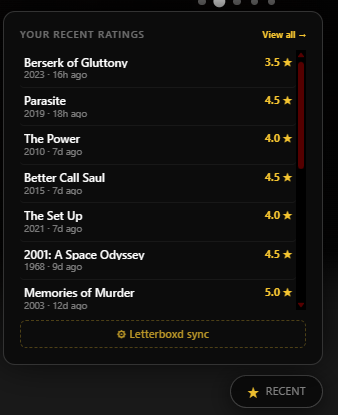
</p>

<p align="center">
  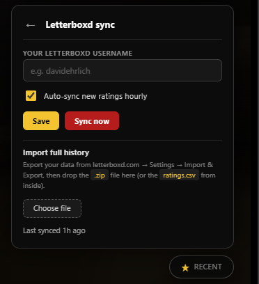
</p>

### Sidebar entry
Auto-injected into the Jellyfin nav menu — no theme changes required.

<p align="center">
  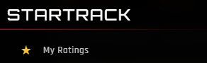
</p>

### Main view + type tabs
Seven top-level views — Media / Watchlist / Liked / Diary / Reviews / For You / Lists — and five type tabs on the Media view: All / Movies / TV Shows / Episodes / Anime. Anime is detected via genre or tag, so a movie or series can count as anime regardless of its underlying Jellyfin type.

<p align="center">
  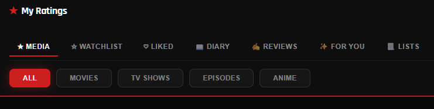
</p>

### Stats, sort, search, Letterboxd + export
Live search with a 150 ms debounce, seven sort options (date rated, film year, your rating, community rating, runtime — each ↑↓), one-click Letterboxd settings pane, and CSV export in Letterboxd-compatible format.

<p align="center">
  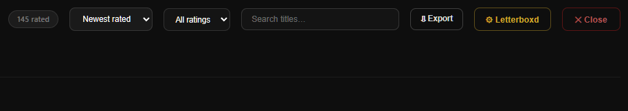
</p>

### Top 4 Movies + full poster grid
Pinned Top 4 sits above the full grid, full-poster cards with a star tier ribbon, year and runtime overlay. Hover any card to reveal Pin / Add to list buttons.

<p align="center">
  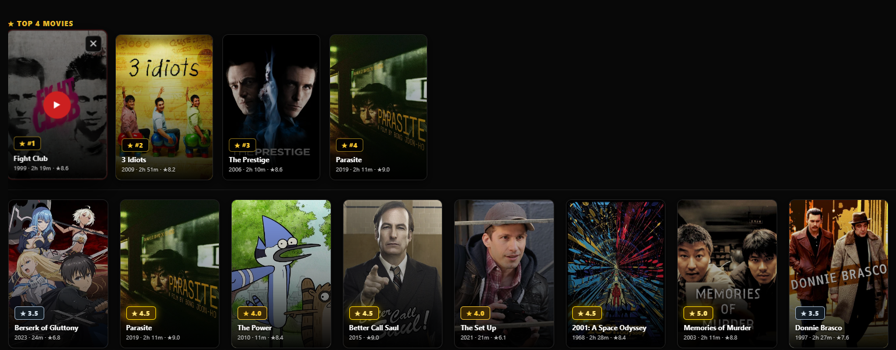
</p>

### Top 4 Movies (detail)
Per-type Top 4: 4 movies, 4 series, 4 episodes, max 12 total. Each pinned slot shows its rank, star tier, year and runtime, and hovering reveals an × remove button.

<p align="center">
  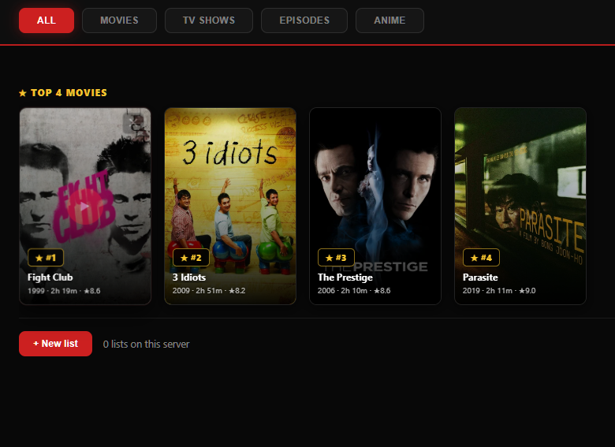
</p>

### Reviews feed
Server-wide vertical feed of every rating that has a written review, with poster, reviewer, star bar, date and review text. (Reviewer name and review text blurred in this screenshot.)

<p align="center">
  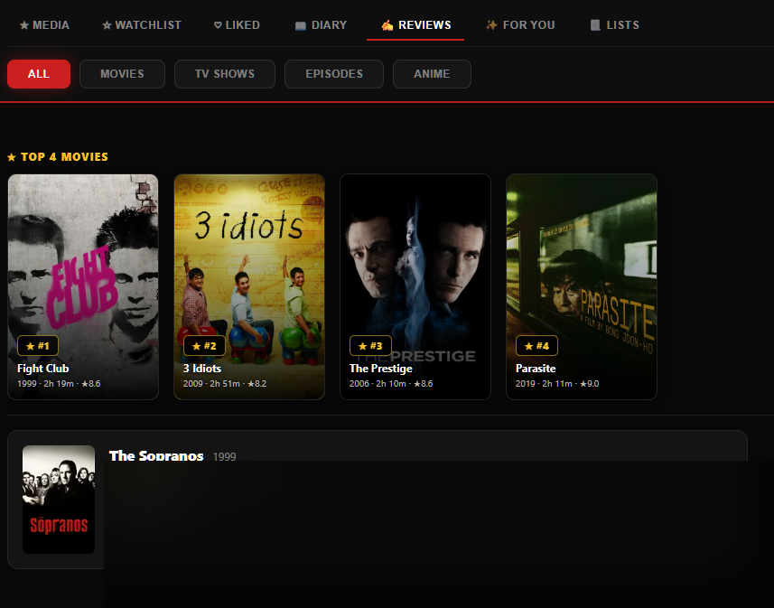
</p>

### Letterboxd sync
Letterboxd-compatible sync pane: username input, hourly auto-sync toggle, one-click Sync Now (pulls RSS ratings + watchlist + likes scrape), ZIP drop zone for full exports, Import Top 4 from your public profile, Diagnose button for matcher diagnostics, and Clean dead ratings to purge zombie entries after a library rebuild.

<p align="center">
  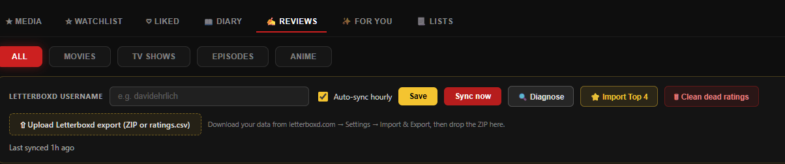
</p>

---

## Requirements

- **Jellyfin 10.11.x** (built against 10.11.6)
- A modern browser (Chromium / Firefox / Safari)
- For Letterboxd auto-sync: a Letterboxd account with **public** profile, watchlist and likes pages

StarTrack uses ASP.NET Core middleware to inject its widget at runtime. No File Transformation plugin required.

---

## Installation

### Option A — Plugin Repository *(recommended)*

1. Jellyfin → **Dashboard → Plugins → Repositories → +**
2. Add:
   ```
   https://raw.githubusercontent.com/ZL154/jellyfin-plugin-startrack/main/manifest.json
   ```
3. Go to **Catalogue**, find **StarTrack**, install it, and **restart Jellyfin**.

### Option B — Manual

1. Download `Jellyfin.Plugin.InternalRating_*.zip` from [Releases](https://github.com/ZL154/jellyfin-plugin-startrack/releases)
2. Extract the DLL into your Jellyfin plugins folder:
   ```
   <jellyfin-data>/plugins/StarTrack/Jellyfin.Plugin.InternalRating.dll
   ```
3. Restart Jellyfin.

### Verify

After restarting, visit:
```
https://your-jellyfin-server/Plugins/StarTrack/Debug
```

You should see `Plugin loaded: YES`. Then open any Movie, TV Show, or Episode detail page — the `☆ Rate` pill will appear.

---

## How to use

### Rating pill (detail page)
A small floating pill appears at the bottom-right of every Movie / Series / Episode detail page. Click it to:
- Set your rating (half-star precision)
- Optionally write a review
- See the community average and per-user breakdown
- One-click **❤ like**, **☆ watchlist**, or **★ pin to Top 4**

### My Ratings overlay
Click **My Ratings** in the Jellyfin sidebar to open the full overlay. The view selector at the top has seven tabs:

- **★ Films** — your full rating grid + pinned Top 4 row
- **☆ Watchlist** — your watchlist, with a toggle to view everyone's combined watchlist filtered by user
- **♡ Liked** — every film you've hearted
- **📖 Diary** — chronological journal with rewatches and visual star bars
- **✍ Reviews** — server-wide review feed
- **✨ For you** — personalised recommendations
- **📃 Lists** — your and others' collaborative lists

Each view supports search, sort, type filter, and (where applicable) star filter.

### Letterboxd sync
1. Export your data from letterboxd.com → **Settings → Import & Export → Export Your Data**
2. In StarTrack, click the **⚙ Letterboxd** button in the topbar
3. Enter your Letterboxd username, optionally enable hourly auto-sync, save
4. Drop the export ZIP into the upload box — ratings, diary, watchlist and likes import in one pass
5. Click **⭐ Import Top 4** to scrape your Letterboxd profile's favourite films
6. Click **Sync now** any time to pull your latest ratings + watchlist + likes via RSS / HTML scrape

### External sync (Trakt / Simkl / Yamtrack)
1. **Admin (one-time):** Dashboard → Plugins → StarTrack — paste a **Trakt** client ID + secret and/or a **Simkl** client ID (create a free app on each service's developer page). This is server-wide; users don't need their own keys.
2. In *My Ratings*, open the **⇄ External Sync** panel.
3. **Connect** a service:
   - **Trakt** — click connect, you'll get a code to enter at `trakt.tv/activate`.
   - **Simkl** — click connect and approve the PIN.
4. Choose a **direction** for that service: Off / Export only / Import only / Two-way.
5. Click **Sync** (or just wait — it auto-syncs every 10 minutes). In two-way mode the newer rating wins on each side.
6. **Backfill** (optional) seeds the service from your whole library in one pass, and marks rated items watched.
7. **Yamtrack:** click **⇩ Yamtrack CSV** to download an IMDb-format file, then in Yamtrack go to **Import → IMDb** and upload it. (Yamtrack has no public rating API yet — see notes above.)

> Ratings only import for items that exist in your Jellyfin library; titles you rated on a service but don't own can't be matched.

---

## API Reference

All endpoints are under `/Plugins/StarTrack/`. Every endpoint requires Jellyfin authentication unless otherwise noted.

### Ratings
| Method | Endpoint | Description |
|---|---|---|
| `GET` | `/Ratings/{itemId}` | Average + every user's rating and review |
| `POST` | `/Ratings/{itemId}` | Submit / update your rating `{"stars":4,"review":"..."}` |
| `DELETE` | `/Ratings/{itemId}` | Remove your rating |
| `GET` | `/MyRatings?limit=N` | All your rated items, newest first |
| `GET` | `/Recent?limit=N` | Recent ratings across all users |
| `GET` | `/Stats` | Server-wide rating count |
| `GET` | `/ExportCsv` | Download your ratings as Letterboxd-compatible CSV |

### Watchlist / liked / favourites
| Method | Endpoint | Description |
|---|---|---|
| `GET` | `/MyWatchlist` | Your watchlist |
| `GET` | `/EveryonesWatchlist` | Every user's watchlist aggregated, with per-item user lists |
| `POST` | `/Watchlist/{itemId}` | Add an item to your watchlist |
| `DELETE` | `/Watchlist/{itemId}` | Remove an item |
| `GET` | `/MyLikes` | Your liked films |
| `POST` | `/Likes/{itemId}` | Like an item |
| `DELETE` | `/Likes/{itemId}` | Unlike an item |
| `GET` | `/MyFavorites` | Your Top 4 (max 12 across types) |
| `POST` | `/MyFavorites` | Replace your favourites `{"itemIds":[...]}` |
| `GET` | `/Interactions/{itemId}` | Combined watchlisted/liked/favourite status for one item |
| `GET` | `/Recommendations?limit=N` | Personalised picks weighted by your top genres |

### Diary
| Method | Endpoint | Description |
|---|---|---|
| `GET` | `/MyDiary?limit=N` | Your chronological diary with rewatches |
| `POST` | `/Diary` | Manually add a diary entry (`{"itemId","watchedAt","stars","review","rewatch"}`) |
| `DELETE` | `/Diary/{entryId}` | Remove a diary entry |

### Lists
| Method | Endpoint | Description |
|---|---|---|
| `GET` | `/Lists` | All lists on the server |
| `POST` | `/Lists` | Create a list `{"name","description","collaborative"}` |
| `GET` | `/Lists/{listId}` | Single list with all items |
| `DELETE` | `/Lists/{listId}` | Delete (owner only) |
| `POST` | `/Lists/{listId}/Items` | Add a film `{"itemId":"..."}` |
| `DELETE` | `/Lists/{listId}/Items/{itemId}` | Remove a film |

### Letterboxd sync
| Method | Endpoint | Description |
|---|---|---|
| `GET` | `/Letterboxd/Settings` | Your Letterboxd username + auto-sync state |
| `POST` | `/Letterboxd/Settings` | Save username + auto-sync toggle |
| `POST` | `/Letterboxd/SyncNow` | Pull ratings (RSS) + watchlist (RSS) + likes (HTML scrape) |
| `POST` | `/Letterboxd/Import` | Upload ZIP or CSV — auto-extracts ratings.csv, diary.csv, watchlist.csv, likes/films.csv |
| `POST` | `/Letterboxd/ScrapeFavorites` | Scrape your Letterboxd profile's "favourite films" section |
| `POST` | `/Letterboxd/Cleanup` | Purge ratings whose library item no longer has a file on disk |
| `GET` | `/Letterboxd/Diagnose` | Library matcher diagnostic + sample of normalised titles |

### External sync *(new in 1.6)*
All under `/Plugins/StarTrack/ExternalSync/`. `{provider}` is `trakt`, `simkl`, or `yamtrack`.
| Method | Endpoint | Description |
|---|---|---|
| `GET` | `/Status` | Connection state + direction for every provider |
| `POST` | `/{provider}/StartAuth` | Begin device-code / PIN login |
| `POST` | `/{provider}/PollAuth` | Poll for auth completion + store token |
| `POST` | `/Yamtrack/Connect` | Connect Yamtrack with a base URL + token |
| `POST` | `/{provider}/SetDirection` | Set Off / ExportOnly / ImportOnly / TwoWay |
| `POST` | `/{provider}/Sync` | Run a sync now |
| `POST` | `/{provider}/BackfillWatched` | One-shot library backfill (marks watched / repairs dates) |
| `POST` | `/{provider}/Disconnect` | Remove the stored token for a provider |
| `GET` | `/Export?format=letterboxd\|imdb\|yamtrack` | Download ratings as CSV/JSON in the chosen format |
| `POST` | `/Import` | Import ratings from an uploaded CSV/JSON file |

### Members & social *(new in 1.5)*
| Method | Endpoint | Description |
|---|---|---|
| `GET` | `/Members` | All visible members with avatar, totals, Top 4, follow flag |
| `GET` | `/MembersSearch?q=` | Same as `/Members`, filtered by name |
| `GET` | `/Members/{userId}/Profile` | Light profile bundle (recents, top-4, watchlist, likes, diary preview) |
| `GET` | `/Members/{userId}/Stats` | Heavy stats — histogram, genres, directors, actors, decades, hours, calendar heatmap, on-this-day, most-rewatched, year cards |
| `GET` | `/Members/{userId}/Reviews` | All of a user's reviews |
| `GET` | `/Members/{userId}/Followers` / `/Following` | Follow graph |
| `POST` | `/Members/{userId}/Follow` / `/Unfollow` | Follow / unfollow a member |
| `GET` | `/Activity?scope=following\|everyone&limit=N` | Chronological feed of recent ratings + diary + reviews |
| `GET` | `/Compare?a={userIdA}&b={userIdB}` | Pearson similarity, both histograms, biggest disagreements, films-each-loved |
| `GET` | `/MyPrivacy` | Your privacy flags (hide from members / follower count / following / stats / activity) |
| `POST` | `/MyPrivacy` | Update your privacy flags |

### Config & translations *(new in 1.4)*
| Method | Endpoint | Description |
|---|---|---|
| `GET` | `/PublicConfig` | Admin toggle state + supported languages (no auth) |
| `GET` | `/Translations/{lang}` | JSON translation bundle for a language (no auth) |
| `GET` | `/AdminConfig` | Current plugin configuration (admin only) |
| `POST` | `/AdminConfig` | Save plugin configuration (admin only) |

### Misc
| Method | Endpoint | Description |
|---|---|---|
| `GET` | `/Widget` | Embedded widget JavaScript (no auth) |
| `GET` | `/WhoAmI` | Auth debug for the current session |
| `GET` | `/Debug` | Diagnostic report (no auth) |

---

## Data storage

All data is stored as plain JSON in `<jellyfin-data>/data/InternalRating/`:

| File | Contents |
|---|---|
| `ratings.json` | Per-item rating + review per user |
| `user_interactions.json` | Per-user watchlist, liked films, Top 4 favourites |
| `diary.json` | Chronological diary entries with rewatch flag |
| `lists.json` | All collaborative lists |
| `letterboxd.json` | Per-user Letterboxd sync settings (username, auto-sync, last-synced state) |
| `follows.json` *(new in 1.5)* | Per-user follow graph |
| `privacy.json` *(new in 1.5)* | Per-user privacy flags (hide stats / activity / followers / etc) |
| `external-sync.json` *(new in 1.6)* | Per-user, per-provider external-sync settings: direction, OAuth tokens, last-sync state |

Back them up or migrate them like any other data file — no database required.

---

## Building from source

```bash
git clone https://github.com/ZL154/jellyfin-plugin-startrack.git
cd jellyfin-plugin-startrack/InternalRatingSystem
dotnet publish -c Release -o ./publish_out
```

The compiled DLL is at `publish_out/Jellyfin.Plugin.InternalRating.dll`.

> **Version note:** The plugin must be compiled against the `Jellyfin.Controller` NuGet package version that exactly matches your server. The csproj currently targets `10.11.6`. Update `<PackageReference>` if your server version differs.

---

## Contributing

Issues and pull requests are welcome.

- [Report a bug](https://github.com/ZL154/jellyfin-plugin-startrack/issues)
- [Suggest a feature](https://github.com/ZL154/jellyfin-plugin-startrack/discussions)

---

## ❤ Support the project

StarTrack is built and maintained in my spare time. If it's useful to you and you'd like to support ongoing development, any of these means a lot:

- ⭐ **Star this repo** — it's free and helps others find it
- 💖 **[Sponsor on GitHub](https://github.com/sponsors/ZL154)** — one-off or monthly, every dollar reaches the project
- ☕ **[Buy me a coffee on Ko-fi](https://ko-fi.com/zl154)** — one-off tips

Not expected, just appreciated. Contributions — issues, PRs, translation fixes — are equally valuable.

---

## License

[MIT](LICENSE) — © 2025 ZL154

---

<div align="center">
<sub>Built by ZL154 · AI-assisted development with <a href="https://claude.ai/claude-code">Claude Code</a></sub>
</div>
